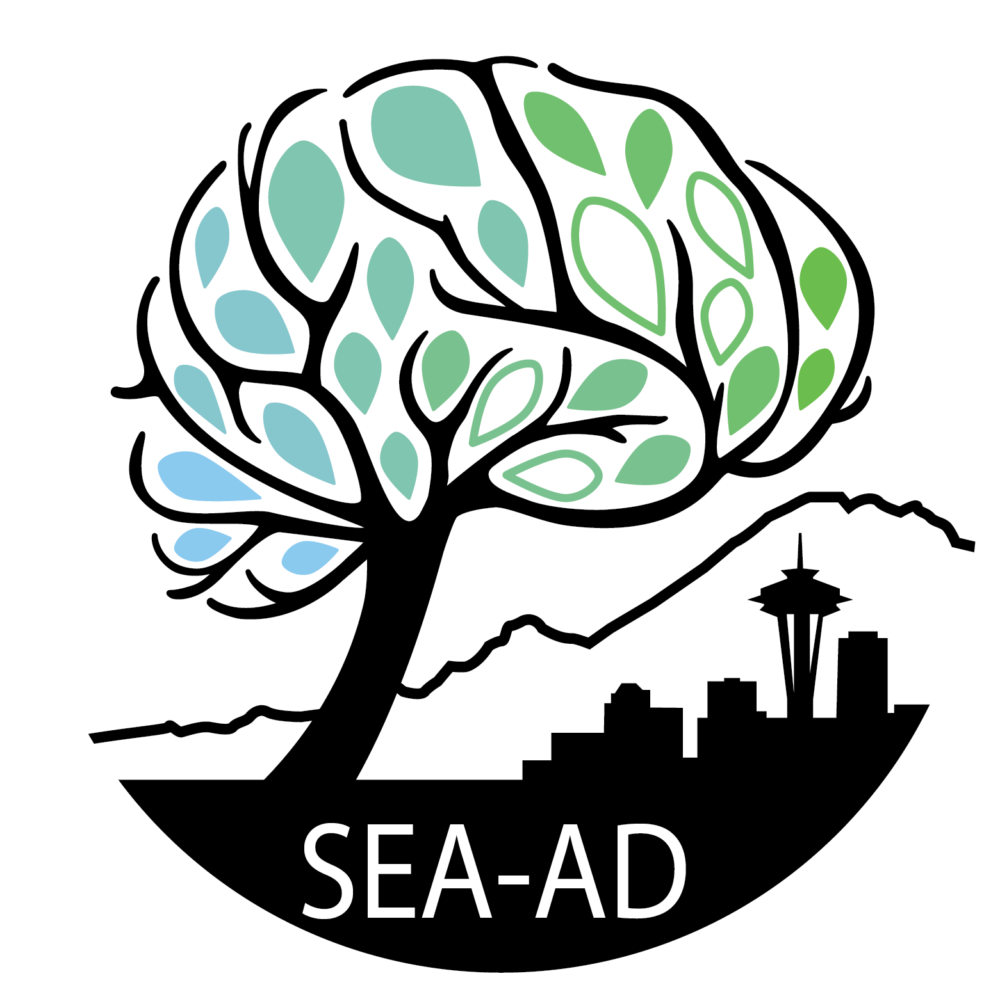

# Seattle Alzheimer's Disease Brain Cell Atlas

The Seattle Alzheimer’s Disease Brain Cell Atlas (SEA-AD) consortium strives to gain a deep molecular and cellular understanding of the early pathogenesis of Alzheimer’s disease. We provide free, open resources to the scientific community. Details are available at [SEA-AD.org](https://sea-ad.org)

The code for pre-processing each data modality into the publicly available datasets are organized into separate top level folders: [Quantitative neuropathology](Quantitative%20neuropathology), [Single nucleus omics](Single%20nucleus%20omics), [Spatial Transcriptomics](Spatial%20Transcriptomics), and [Patchseq](Patchseq). The notebooks contained within are named by the order they were run (e.g. the first run folders and notebooks have lower numbers). The last top level folder Figures[Figures] contains the code used to build each figure panel. All of these take publicly available outputs from the pre-processing notebooks as input to facilitate their reproduction, except as otherwise noted due to the terms of data use agreements.

## Data locations
Detailed documentation of datasets and their locations is available at [SEA-AD.org](https://portal.brain-map.org/explore/seattle-alzheimers-disease/seattle-alzheimers-disease-brain-cell-atlas-download)

Breifly, the processed single nucleus RNAseq, ATACseq, and Multiome as well as MERFISH datasets are available from the [AWS Open Data Registry](https://registry.opendata.aws/allen-sea-ad-atlas/). Raw sequencing data and SNP chip data are available through the [AD Knowledge Portal](http://adknowledgeportal.synapse.org/Explore/Studies/DetailsPage?Study=syn26223298). Processed quantitative neuropathology are available [here](https://brainmapportal-live-4cc80a57cd6e400d854-f7fdcae.divio-media.net/filer_public/f0/1a/f01acfd1-63e5-4de5-afc6-729af9a80cc9/sea-ad_all_mtg_quant_neuropath_bydonorid_081122.csv) and the raw images used to generate these values are [here](https://registry.opendata.aws/allen-sea-ad-atlas). Finally, donor metadata is available [here](https://brainmapportal-live-4cc80a57cd6e400d854-f7fdcae.divio-media.net/filer_public/b4/c7/b4c727e1-ede1-4c61-b2ee-bf1ae4a3ef68/sea-ad_cohort_donor_metadata_072524.xlsx).

## Manuscript
The manuscript is available on [bioRxiv](https://www.biorxiv.org/content/10.1101/2023.05.08.539485v3.full).

## Questions?
Please direct questions about the code, data, or the SEA-AD project to our [online forum](https://community.brain-map.org/) or to the corresponding authors: Drs [Ed Lein](mailto:EdL@alleninstitute.org), [C. Dirk Keene](mailto:cdkeene@uw.edu), and [Michael Hawrylycz](mailto:mikeh@alleninstitute.org).

## Acknowledgements
The Seattle Alzheimer’s Disease Brain Cell Atlas (SEA-AD) consortium is supported by the National Institutes on Aging (NIA) grant U19AG060909. Study data were generated from postmortem brain tissue donated to the University of Washington BioRepository and Integrated Neuropathology (BRaIN) laboratory and Precision Neuropathology Core, which is supported by the UW Alzheimer’s Disease Research Center (NIA P30AG066509, previously P50AG005136), the Adult Changes in Thought (ACT) Study (NIA U19AG066567). ACT Data collection for this work was additionally supported, in part, by prior funding from NIA (U01AG006781), and the Nancy and Buster Alvord Endowment. We thank the participants of the ADRC and the ACT study for the data they have provided and the many ADRC and ACT investigators and staff who steward that data. You can learn more about [UW ADRC](https://depts.washington.edu/mbwc/adrc) and [ACT](https://actagingstudy.org/). We thank AMP-AD, Sage Bionetworks and the Open Data Registry on AWS for hosting various datasets from this study.
